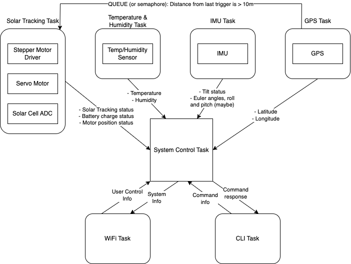

# a07g-exploring-the-CLI

* Team Number: 02
* Team Name: APATHY Rover
* Team Members: Maryam Ali, Chris Connolly
* GitHub Repository URL: https://github.com/ese5160/final-project-a07g-a14g-t02-a-p-a-t-h-y
* Description of test hardware: (development boards, sensors, actuators, laptop + OS, etc)

## 0. Install Percepio

## 1. Software Architecture

1. **Updated SRS and HRS**

Additions in **bold**, deletions ~~crossed out~~.

### HRS

**General**

| # | Requirement specification | Status |
| --------- | -------- | -------- |
| HRS-G-01 | The project shall use a SAMW25 as the central module. | |
| HRS-G-02 | The project shall use the WINC1500 to communicate with Node-red over Wi-Fi. | |
| HRS-G-03 | The project shall use the SAMD21 MCU to connect to a GPS, IMU, Temp/Humidity sensor, and ADCs. | |
| HRS-G-04 | The project shall use a battery of at least 4V that can power the MCU and electronics for an average of 5 hours. | |
| HRS-G-05 | The project shall have an on/off button to power the entire system. | |
| HRS-G-06 | The project shall use a boost converter to step-up the battery voltage **to 12V** to power the stepper motor driver. | |
| HRS-G-07 | The project shall use a boost converter to step-up the battery voltage **to 5V** to power the servo motor. | |
| HRS-G-08 | The project shall use a buck converter to step-down the battery voltage **to 3.3V** to power the MCU, **GPS, temp/humidity, IMU, and other logic level high signals**. | |

**Sensors**

| # | Requirement specification | Status |
| --------- | -------- | -------- |
| HRS-S-01 | The system shall use a temperature sensor to provide Celsius readings correct to a tenth of a degree. | |
| HRS-S-02 | The system shall use a humidity sensor to provide surrounding humidity readings as a percentage correct to 3SF. | |
| HRS-S-03 | The system shall use an IMU accelerometer and gyroscope to collect 3-dimensional readings with an accuracy of .5G and .1 deg/s respectively. | |
| HRS-S-04 | The system shall use a GPS to provide the rover's location correct to 10 meters. | |
| HRS-S-04 | The GPS should provide latitude and longitude values correct to 3 decimal points. | |
| HRS-S-05 | The MCU shall communicate with the IMU and temp/humidity sensor over I2C.  | |
| HRS-S-06 | The system should combine all I2C peripherals on one I2C bus.  | |
| **HRS-S-07** | **The MCU shall communicate with the GPS over UART.**  | |

**Solar Tracking**

| # | Requirement specification | Status |
| --------- | -------- | -------- |
| HRS-ST-01 | The system shall incorporate a solar cell to collect and store energy into a rechargeable battery. | |
| HRS-ST-02 | The system shall use an ADC to monitor the voltage of the solar cell. | |
| ~~HRS-ST-03~~ | ~~The system should use a diode to prevent reverse current from the battery to the solar cell.~~ | |
| HRS-ST-04 | The system shall use a stepper motor to actuate solar cells 360 degrees around the y-axis in 10 degree increments. It will be controlled using a driver. | |
| HRS-ST-05 | The system shall use a servo motor to actuate solar cells 180 degrees around the z-axis in 10 degree increments. | |
| HRS-ST-06| The system shall use a potentiometer to ~~vary the load in the solar tracking circuit, which will be used in the MPPT process.~~ **tune a MPPT IC** | |
| HRS-ST-07 | The system shall use a MOSFET to complete the circuit from the solar cell to rechargeable battery after the ideal resistance is determined. | |

**Wireless**

| # | Requirement specification | Status |
| --------- | -------- | -------- |
| HRS-W-01 | The WINC1500 will be used to send data packets containing ~~sensor~~ **peripheral** data (GPS coordinates, temperature, humidity, **tilt status**, solar tracker charge, **motor position**) to the Node-red UI to be displayed. | |

**Motor Control (Will likely drop this feature)**

| # | Requirement specification | Status |
| --------- | -------- | -------- |
| ~~HRS-M-03~~ | ~~The prototype shall have 4 wheel drive.~~ | |
| ~~HRS-M-04~~ | ~~The controller shall have 2 joysticks to control the rover. One joystick will control the left pair of wheels, the other will control the right.~~ | |
| ~~HRS-M-05~~ | ~~The motors shall be chosen to give the car a top speed of at least 10mph.~~ | |

### SRS

**Sensors**

| # | Requirement specification | Status |
| --------- | -------- | -------- |
| SRS-S-01 | The system shall pull temperature and humidity data at a speed of 2Hz. | |
| SRS-S-02 | The system shall collect longitude and latitude values from the GPS at a speed of 2Hz and will be correct to .1 deg. | |
| SRS-S-03 | A calibration routine shall be run after initial start-up to identify the rest state of IMU. | |
| SRS-S-04 | Acceleration and gyration data will be collected from the IMU correct to .5G and .1 deg/s at a speed of 2Hz and further processing will be used to determine whether the rover has fallen over or not. | |
| SRS-S-05 | The system should apply the Haversine formula to the latitude and longitude values every 10 seconds to determine when the rover has moved at least 10 meters for solar tracking. | |

**Solar Tracking**

| # | Requirement specification | Status |
| --------- | -------- | -------- |
| SRS-ST-01 | The system should have a solar-tracking mode that is activated when the rover has moved at least 10 meters from its previous solar tracking point. | |
| SRS-ST-02 | The system shall determine the solar cell orientation and load for optimal charging within 1 minute. | |
| SRS-ST-03 | The solar tracking system shall read ADC data to determine the voltage of each solar cell orientation in the y and z-axis. | |
| SRS-ST-04 | The firmware shall determine the maximum ADC reading in the y-direction and fix the corresponding stepper postion. | |
| SRS-ST-05 | The firmware shall determine the maximum ADC reading in the z-direction and fix the corresponding servo postion. | |
| SRS-ST-06 | The system shall fix the orientation of the solar cell and use the Maximum Power Point Tracking (MPPT) technique to identify load value for optimal battery charging. | |
| ~~SRS-ST-07~~ | ~~The system should compute the battery's state of charge.~~ | |

**Node-red UI**

| # | Requirement specification | Status |
| --------- | -------- | -------- |
| SRS-NR-01 | The project shall have a Node-red UI. | |
| SRS-NR-02 | The UI shall have a display panel that shows the status of the rover's tilt. This value will either be "steady" or "toppled over". | |
| SRS-NR-03 | The display panel shall report the temperature in Celsius. | |
| SRS-NR-04 | The display panel shall report the relative humidity as a percentage. | |
| SRS-NR-05 | The display panel shall display the GPS latitude and longitude correct to a tenth of a degree. | |
| SRS-NR-06 | The system ~~shall~~ **should** use Google Maps API to show the real-time position of the rover on a map interface. | |
| SRS-NR-07 | The display panel shall have an LED that changes color based on the battery voltage level. These levels will be high (green), medium (yellow), and low (red). | |
| SRS-NR-08 | The UI should update sensor values at least once every second. | |
| SRS-NR-09 | The system shall display the solar tracking status on the UI. | |
| SRS-NR-10 | Solar tracking status strings should include "Determining orientation...", "Computing load...", "Optimal charging achieved." | |

2. **Task Block Diagram**

3. **Task State Machines**

## 2. Understanding the Starter Code

1. What does “InitializeSerialConsole()” do? In said function, what is “cbufRx” and “cbufTx”? What type of data structure is it?

InitializeSerialConsole() initializes the USART communication, defines the data structures for RX and TX, and starts to read characters. “cbufRx” and “cbufTx” are the ring buffers (circular queues) that contain data coming from and going to the console respectively.

2. How are “cbufRx” and “cbufTx” initialized? Where is the library that defines them (please list the *C file they come from).

They are initalized as circular buffer pointers. This is initialized in SerialConsole.c, and the circular buffers is implemented in circular_buffer.c.

3. Where are the character arrays where the RX and TX characters are being stored at the end? Please mention their name and size. Tip: Please note cBufRx and cBufTx are structures.

Ultimately, the data is being stored in a char array called rxCharacterBuffer and txCharacterBuffer which both have a size of 512 bytes. This data structure is passed to the circular buffer structure in circular_buf_init.

4. Where are the interrupts for UART character received and UART character sent defined?

The interrupts are handeled usart_interrupt.c. The callback functions are implemented in SerialConsole.c as usart_write_callback() and usart_read_callback. They are linked through the usart_module type thats initialized as usart_instance in SerialConsole.c.

5. What are the callback functions that are called when:

- A character is received? (RX): usart_read_callback()

- A character has been sent? (TX): usart_write_callback()

6. Explain what is being done on each of these two callbacks and how they relate to the cbufRx and cbufTx buffers.

In the usart_write_callback() function, a single char is being passed from the cbufTx buffer to a data structure inside of the usart handling structure. In the usart_read_callback() function, the cbufRx buffer is linked to a data strcuture inside of the usart handling structure so that it can pass cbufRx the incoming data.

7. Draw a diagram that explains the program flow for UART receive – starting with the user typing a character and ending with how that characters ends up in the circular buffer “cbufRx”. Please make reference to specific functions in the starter code.

8. Draw a diagram that explains the program flow for the UART transmission – starting from a string added by the program to the circular buffer “cbufTx” and ending on characters being shown on the screen of a PC (On Teraterm, for example). Please make reference to specific functions in the starter code.

9. What is done on the function “startStasks()” in main.c? How many threads are started?

startStasks() doesn't exist, but "StartTasks()" first prints the heap size before starting the tasks an dthne after using. One task is started using the xTaskCreate() fucntion. This task is the CLI task.

## 3. Debug Logger Module

LogMessage() function in [this file](https://github.com/ese5160/final-project-a07g-a14g-t02-a-p-a-t-h-y/blob/main/CLI%20Starter%20Code/src/SerialConsole/SerialConsole.c).

## 4. Wiretap the convo!

1. What nets must you attach the logic analyzer to? (Check how the firmware sets up the UART in SerialConsole.c!)

We attach to the PB10 and PB11 pins.

2. Where on the circuit board can you attach / solder to?

We can attach/solder to header pins and test points.

3. What are critical settings for the logic analyzer?

The communication type (e.g. Async Serial), channel number, bit rate, bits per frame, stop bits, parity bits, significant bit, signal inversion, and mode. For this question, the two critical settings were the communication type and the bit rate.

### Hardware connections

### Decoded message screenshot

Capture file [here](https://github.com/ese5160/final-project-a07g-a14g-t02-a-p-a-t-h-y/blob/main/part_4_capture.sal).

## 5. Complete the CLI

FreeRTOS_read() in [this file](https://github.com/ese5160/final-project-a07g-a14g-t02-a-p-a-t-h-y/blob/main/CLI%20Starter%20Code/src/CliThread/CliThread.c).

usart_read_callback() in [this file](https://github.com/ese5160/final-project-a07g-a14g-t02-a-p-a-t-h-y/blob/main/CLI%20Starter%20Code/src/SerialConsole/SerialConsole.c).

## 6. Add CLI commands

CLI commands (xCliVersion() and xCliTicks()) in [this file](https://github.com/ese5160/final-project-a07g-a14g-t02-a-p-a-t-h-y/blob/main/CLI%20Starter%20Code/src/CliThread/CliThread.c).

Video [here](https://github.com/ese5160/final-project-a07g-a14g-t02-a-p-a-t-h-y/blob/main/a07g_images/clip_video.mp4).

<video controls src="a07g_images/clip_video.mp4" title="Title"></video>

## 7. Using Percepio

### Percepio Trace